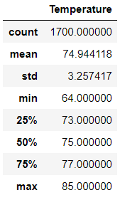

# Surfs_Up

## Overview of Statistical Analysis:
The purpose of the Surf's up analysis is to go through a sql dataset on the weather of Hawaii for two specific months in question: June and December. The data is further analyzed to find . Finally, a visual representation was created to showcase the Total Fare by City Type over a select range of dates (January to April). This was completed by using Panda to code on Jupyter Notebook and Matplotlib to generate the line graph. 

## Results

The largest total fares are in Urban areas due to the concentration of people and drivers. Urban areas naturally have more people living within close proximity compared to Suburban and Rural areas, where Rural areas have a lower population with further proximity of people living near each other. The graph fairly represents the 3 types by showcasing the largest total fares to Urban cities and the lease total fares to Rural cities. The graph also showcases that the least amount of rides happen in early January which is probably due to the inclimental weather. There is a significant increase in the last week of February in all 3 areas which could be realated to an event or holiday that could have created the surge. 

### Summary of Total Fare by City Type

## Summary
Overall, we can conclude that the most profitable city type is Urban due to the volume of rides and drivers. Even though Urban areas have the largest total fare, Rural areas have the hightest average per ride due to the distance of travel, but shows less than 5 times the total fare amounts compared to Urban. It is also fair to conclude that the average along the 4 months for each city type remains fairly constant except for the early January week were the decline could be a result of weather. 
