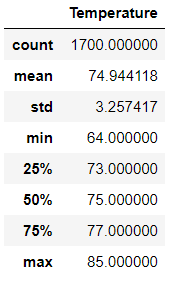
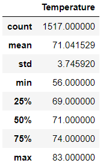

# Surfs_Up

## Overview of Statistical Analysis:
The purpose of the Surf's up analysis is to go through a sql dataset on the weather of Hawaii for two specific months in question: June and December. The data is further analyzed to find the variablity of each month and if the business could operate with the average temperature of each month. This was completed by using Python to code on Jupyter Notebook analyzing an SQL Dataset. 

### Statistics of June Weather

### Statistics of December Weather

## Results

The average temperature in June was 74.9 degrees fahrenheit (23.8 degrees celcius) with a standard deviation of 3.25. The average temperature in December was 71.0 degrees fahrenheit (21.7 degrees celcius) with a standard deviation of 3.75. With a minimal variance between the datasets and maintaining tropical weather within each month in question. it is fair to assume that the weather in these 2 months will not be a hurdle for this business plan.

## Summary
Since there is not much variance in temperature change during each month and considering the temperature is maintained in the mid-20's in degrees celcius, it would be more than ideal temperatures for a business to be operational. In fact. the cooler temperature would probably be more preferred than scorching heat. Overall, we can conclude that the temperature in both June and December are not low enough for an outdoor business to not be able to run. In fact, it seems promising that the weather would not be an obstacle for this business plan.
